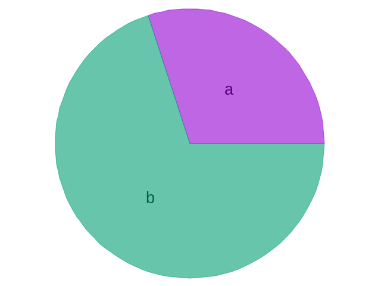
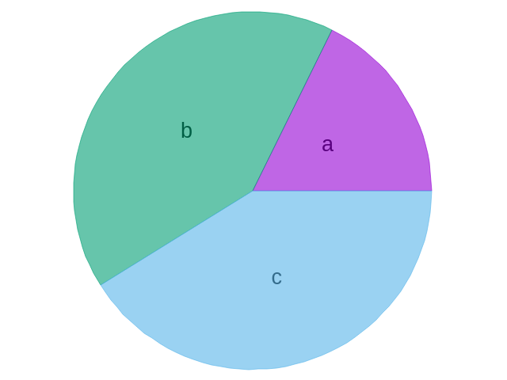
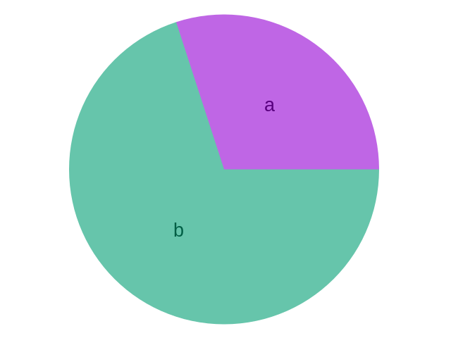

# Gpop | Pie (Tutorial)

| [Home](./Pie.md) | [Tutorial](./Pie_tuto.md) | [API](./html/index.html) |
|------------------|---------------------------|-------------------------|

[TOC]

## Tutorial1 | Simple plotting
２つの要素をstd::double型でプロット用クラスに渡し，描画を行うサンプル



```cpp
#include <iostream>
#include <Gpop/Pie.hpp>

int main(void)
{
	Gpop::Pie plot;
	
	//要素を追加（割合，要素名）
	plot.plot(30, "a");
	plot.plot(70, "b")
	
	plot.show();
	
	std::cin.get();
	return 0;
}
```

## Tutorial2 | Simple plotting(Total is not 100)


```cpp
#include <iostream>
#include <string>
#include <Gpop/Pie.hpp>

int main(void)
{
	Gpop::Pie plot;
	std::string str;
	
	//合計が100でない場合も問題ない
	plot.plot(30, "a");
	plot.plot(70, "b");
	plot.plot(70, "c");
	
	//合計が100になるように再計算されて描画
	plot.show();
	
	std::cin.get();
	return 0;
	
}
```

## Tutorial3 | Saving plot as png

```cpp
#include <iostream>
#include <Gpop/Pie.hpp>

int main(void)
{
	Gpop::Pie plot;
	
	//要素を追加（割合，要素名）
	plot.plot(30, "a");
	plot.plot(70, "b")
	
	plot.show();
	
	//This_is_pie_tutorial.pngとしてプロットを保存
	plot.save_as_png("This_is_pie_tutorial");
	
	std::cin.get();
	return 0;
}
```



## Tutorial4 | Realtime plot

```cpp
#include <iostream>
#include <Gpop/Pie.hpp>

int main(void)
{
	Gpop::Pie plot;
	
	//a要素がだんだん増えていくにつれて
	//b要素が相対的に小さくなる様子をご覧ください
	for (int i = 0; i < 100; i++){
		plot.plot(i, "a");
		plot.plot(50, "b");
		
		//100msecだけ描画のために停止する
		plot.pause(100);
	}
	
	return 0;
}
```