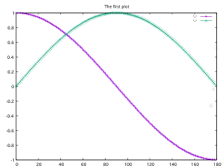

# Gpop | Serise


| [Home](./Series.md) | [Tutorial](./Series_tuto.md) | [API](./html/index.html)|
|--------|--------|------|

## Introduction
Seriseは一連のデータをプロットするものです．
一時ファイルを作成しないことにより，高速に，
しかも，簡単なプログラムによりデータを描画することが可能です．
主に，以下のようなグラフの描画が可能です．


## Usage
下記の例のようにstd::vector<double>,もしくはdouble型の変数を
Gpop::Series::plot()関数に渡すだけで描画することが可能です．

```cpp
#include <iostream>
#include <vector>
#include <cmath>
#include <unistd.h>
#include <Gpop/Series.hpp>

int main(void)
{
	//インスタンス作成
	Gpop::Series plot;
	
	//(0,180)の区間でcos波作成
	std::vector<double> v;
	for (int i = 0; i < 180; i++){
		v.push_back(std::cos(i*M_PI/180));
	}
	
	//データを渡す
	plot.plot(v);
	
	//(0,180)の区間でsin波作成
	v.clear();
	for (int i = 0; i < 180; i++){
		v.push_back(std::sin(i*M_PI/180));
	}
	
	//データを渡す
	plot.plot(v);
	
	//タイトルとか，軸ラベルの設定
	plot.set_title("The first plot");
	plot.set_x_label("x");
	plot.set_y_label("y");
	
	//描画
	plot.show();
}
```


