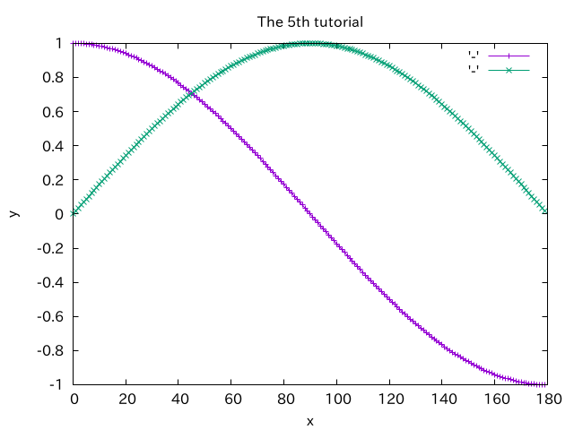

# Gpop | Serise (Tutorial)


| [Home](./Series.md) | [Tutorial](./Series_tuto.md) | [API](./html/index.html)|
|--------|--------|------|


[TOC]

## Tutorial1 | Simple plotting
データをstd::vectorでプロット用クラスに渡し，描画を行うサンプル．


```cpp
#include "Gpop/Series.hpp"
#include <iostream>
#include <string>
#include <vector>
#include <cmath>

int main(int argc, char const* argv[])
{
	//プロットクラスの宣言
	Gpop::Series plot;

	//描画用データの準備
	std::vector<double> v;
	for (int i = 0; i < 180; i++) {
		v.push_back(std::cos(i*M_PI/180));
	}

	//データをプロットクラスに渡す
	plot.plot(v);

	//表示
	plot.show();

	//終了処理
	std::cout << "Press Enter Key" << std::endl;
	std::string end;
	std::cin >> end;

	return 0;
}
```

## Tutorial2 | Basic plotting
複数の系列のデータを一度に描画するサンプル．タイトルも付けるよ．


```cpp
#include <Gpop/Series.hpp>
#include <iostream>
#include <vector>
#include <string>
#include <cmath>

int main(void){
	//Seriesクラスの宣言
	Gpop::Series plot;

	//描画用ベクターの用意
	std::vector<double> v1, v2;
	for (int i = 0; i < 180; i++){
		v1.push_back(std::cos(i*M_PI/180));
		v2.push_back(std::sin(i*M_PI/180));
	}

	//2つのデータを渡す
	plot.plot(v1);
	plot.plot(v2);

	//プロットのタイトルを設定
	plot.set_title("The first plot");

	//データを描画
	plot.show();

	//終了処理
	std::cout << "Press any key" << std::endl;
	std::string key;
	std::cin >> key;

	return 0;
}

```

## Tutorial3 | Save as png
pngファイルとしてプロットを保存するサンプル


```cpp
#include "Gpop/Series.hpp"
#include <unistd.h>
#include <iostream>
#include <string>
#include <vector>
#include <cmath>

int main(int argc, char const* argv[])
{
	Gpop::Series plot;

	std::vector<double> v;
	for (int i = 0; i < 180; i++) {
		v.push_back(std::cos(i*M_PI/180));
	}
	plot.plot(v);

	v.clear();
	for (int i = 0; i < 180; i++) {
		v.push_back(std::sin(i*M_PI/180));
	}
	plot.plot(v);
	
	//プロットのタイトルを設定
	plot.set_title("The 5th tutorial");
	//x軸のラベルを設定
	plot.set_x_label("x");
	//y軸のラベルを設定
	plot.set_y_label("y");
	//表示
	plot.show();
	//test.pngとして保存
	plot.save_as_png("test");

	std::cout << "Press Enter Key" << std::endl;
	std::string end;
	std::cin >> end;

	return 0;
}
```

## Tutorial4 | Realtime plotting
アニメーションとして，データの描画を行うサンプル．

```cpp
#include <iostream>
#include <vector>
#include <cmath>
#include <unistd.h>
#include "Gpop/Series.hpp"

int main(int argc, char const* argv[])
{
	//描画クラスの宣言
	Series plot;
	double data1 = 0;

	//描画用データの作成
	std::vector<double> v;
	for (int i = 0; i < 1000; i++) {
		data1 = std::sin(i * M_PI / 180);

		plot.plot(data1);

		//リアルタイムのときは，whileループの最後にpause()を使用すること
		plot.pause(100);
	}
	return 0;
}
```
